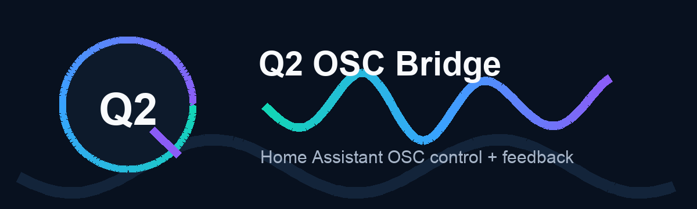

# Q2 OSC Bridge



Q2 OSC Bridge is a Home Assistant custom integration for sending and receiving
Open Sound Control (OSC) directly inside Home Assistant Core. It is built for
HAOS and HACS distribution, and it runs as a normal custom integration rather
than as an add-on, daemon, or external service.

The current release provides real OSC sending, incoming feedback, Home Assistant
events, diagnostics, and working entity mappings for buttons, floats, integers,
booleans, strings, and sensor monitors.

## Installation

### HACS Custom Repository

1. In HACS, open **Custom repositories**.
2. Add `https://github.com/Q-Squared-Systems/q2-osc-bridge`.
3. Choose category `Integration`.
4. Install **Q2 OSC Bridge**.
5. Restart Home Assistant.
6. Add **Q2 OSC Bridge** from **Settings > Devices & services**.

### Manual Install

Copy `custom_components/q2_osc_bridge` into your Home Assistant
`custom_components` directory, then restart Home Assistant.

## HAOS Compatibility

Q2 OSC Bridge runs inside Home Assistant Core on HAOS. UDP ports must be
reachable from the HAOS network environment, and any firewall, VLAN, VM, or
router rules between Home Assistant and OSC devices must allow the configured
ports.

For most HAOS and VM installs, the local bind address should be `0.0.0.0` so the
integration can listen on all Home Assistant network interfaces.

## OSC Targets

Each configured target represents one remote OSC app/device and one local UDP
receive socket.

Target setup fields:

- Name
- Remote host
- Remote port
- Receive enabled
- Local bind address, default `0.0.0.0`
- Local UDP receive port
- Optional allowed source IPs
- Optional keepalive path and interval

The integration owns one asyncio UDP datagram transport per target. That
transport sends to the configured remote host/port and receives on the local
bind address/port.

To change target network settings later, open **Configure** on the target and
choose **Edit target settings**. Existing entity mappings are preserved and the
target reloads automatically.

Keepalive can be enabled per target for OSC devices that require a periodic
subscription or remote-control heartbeat. For X32/M32 feedback, enable
keepalive, use path `/xremote`, and set the interval to `8` seconds.

## Sending OSC

The integration registers the action:

```yaml
action: q2_osc_bridge.send
data:
  endpoint: "MadMapper"
  address: "/layer/1/visible"
  arguments:
    - true
```

You can also target a specific config entry:

```yaml
action: q2_osc_bridge.send
data:
  config_entry_id: "01J..."
  address: "/layer/1/opacity"
  arguments:
    - 0.75
```

Arguments may be omitted, a single scalar value, or a list of OSC-compatible
values.

## Entity Mappings

Open **Settings > Devices & services > Q2 OSC Bridge**, select **Configure** on
a target, then choose an entity mapping action. Reopen Configure for each
additional mapping.

Q2 OSC Bridge uses the UI word `path` for slash-prefixed OSC routes such as
`/layer/1/opacity`. OSC formally calls these addresses or address patterns.

### Button Control

**Add button control** creates a Home Assistant `button` entity.

Fields:

- Button name
- Target path

Pressing the button sends one OSC message with no arguments to the target path.

### Float Control

**Add float control** creates a Home Assistant `number` entity for OSC `f`
arguments.

Fields:

- Control name
- Target path
- Optional source path
- Minimum
- Maximum
- Step

Changing the Home Assistant number sends the new float value as the first OSC
argument to the target path. If a source path is set, incoming OSC feedback at
that path updates the number entity directly.

Example:

- Target path: `/layer/1/opacity`
- Source path: `/layer/1/opacity/feedback`
- Minimum: `0`
- Maximum: `1`
- Step: `0.01`

### Integer Control

**Add integer control** creates a Home Assistant `number` entity for OSC `i`
arguments.

Fields:

- Control name
- Target path
- Optional source path
- Minimum
- Maximum

Changing the Home Assistant number sends the new integer value as the first OSC
argument to the target path. If a source path is set, incoming OSC feedback at
that path updates the number entity directly. Integer controls use a fixed step
of `1`.

### Boolean Control

**Add boolean control** creates a Home Assistant `switch` entity for OSC `T/F`
arguments.

Fields:

- Control name
- Target path
- Optional source path

Turning the switch on sends OSC true. Turning it off sends OSC false. If a
source path is set, incoming boolean-style feedback updates the switch directly.

### String Control

**Add string control** creates a Home Assistant `text` entity for OSC `s`
arguments.

Fields:

- Control name
- Target path
- Optional source path

Changing the text value sends it as the first OSC string argument to the target
path. If a source path is set, incoming OSC feedback at that path updates the
text entity directly.

### Sensor Monitor

**Add sensor monitor** creates a Home Assistant `sensor` entity.

Fields:

- Sensor name
- Source path

When the target receives an OSC message at the source path, the sensor state
updates to the first OSC argument.

## X32 Presets

Q2 OSC Bridge includes starter presets for Behringer X32/M32 consoles. These
presets create a useful group of mapped HA entities without importing the entire
console surface.

Preset screens show one checkbox per entity and default to nothing selected.
Choose only the channels you want to create; for example, checking Channel 01
through Channel 08 creates only those eight mappings.

### Input Channel Mutes

**Add X32 input channel mutes** can create Home Assistant `switch` entities for:

```text
/ch/01/mix/on
...
/ch/32/mix/on
```

The X32 path is named `mix/on`, where `1` means the channel is on and `0` means
the channel is muted. Q2 OSC Bridge exposes these as mute switches where switch
off means muted and sends `0`; switch on means unmuted and sends `1`.

### Input Fader Levels

**Add X32 input fader levels** can create Home Assistant `number` entities for:

```text
/ch/01/mix/fader
...
/ch/32/mix/fader
```

Each fader uses a `0..1` float range with step `0.01`, and uses the same OSC
path for target and source feedback.

### Aux Return Mutes

**Add X32 Aux return mutes** can create Home Assistant `switch` entities for:

```text
/auxin/01/mix/on
...
/auxin/08/mix/on
```

These use the same X32 mute behavior as input channel mutes: switch off means
muted and sends `0`; switch on means unmuted and sends `1`.

### Aux Return Levels

**Add X32 Aux return levels** can create Home Assistant `number` entities for:

```text
/auxin/01/mix/fader
...
/auxin/08/mix/fader
```

Each level uses a `0..1` float range with step `0.01`, and uses the same OSC path
for target and source feedback.

### Aux FX Mutes

**Add X32 Aux FX mutes** can create Home Assistant `switch` entities for:

```text
/auxin/01/mix/on
...
/auxin/08/mix/on
/fxrtn/01/mix/on
...
/fxrtn/08/mix/on
```

These use the same X32 mute behavior as input channel mutes: switch off means
muted and sends `0`; switch on means unmuted and sends `1`.

### Aux FX Channel Levels

**Add X32 Aux FX channel levels** can create Home Assistant `number` entities
for:

```text
/auxin/01/mix/fader
...
/auxin/08/mix/fader
/fxrtn/01/mix/fader
...
/fxrtn/08/mix/fader
```

Each level uses a `0..1` float range with step `0.01`, and uses the same OSC path
for target and source feedback.

For live X32 feedback, enable target keepalive with path `/xremote` and interval
`8` seconds.

## Receive Events

Incoming OSC messages also produce a Home Assistant event named
`q2_osc_bridge_message`. This is useful for debugging and for advanced
automations that do not need a mapped entity.

Example event data:

```json
{
  "endpoint_id": "01J...",
  "entry_id": "01J...",
  "endpoint_name": "MadMapper",
  "source_ip": "192.168.1.50",
  "source_port": 9001,
  "address": "/layer/1/opacity/feedback",
  "arguments": [0.176922976970673],
  "type_tags": "f",
  "timestamp": "2026-07-27T19:30:00.000000+00:00"
}
```

To listen in Home Assistant, go to **Developer Tools > Events** and subscribe to
`q2_osc_bridge_message`.

## Diagnostics

Diagnostics include target configuration with sensitive values redacted where
appropriate, plus runtime counters for:

- Received messages
- Sent messages
- Decode errors
- Send errors
- Last source
- Last message time

## Current Limitations

- Mapping setup supports add/remove, but not editing existing mappings yet.
- Receive mappings use exact OSC path matches.
- Entity mappings currently use the first OSC argument only.
- Button controls send no arguments.
- Float feedback values are accepted as raw floats; display rounding/clamping is
  planned.
- X32 presets currently cover input channel mutes, input fader levels, Aux
  return mutes, Aux return levels, Aux FX mutes, and Aux FX channel levels only.
- Binary sensor and select platforms have scaffolding but are not yet exposed in
  the Configure UI.

## Development

Install test dependencies and run:

```bash
PYTHONPATH=. python -m pytest
```

Additional checks used for releases:

```bash
ruff check .
ruff format --check .
python -m compileall custom_components/q2_osc_bridge
```

Roadmap:

- Add editing for existing entity mappings.
- Add float feedback rounding and min/max clamping.
- Add more X32 preset groups.
- Add binary sensor and select mapping flows.
- Add import/export for mapping presets.
- Add value transforms, availability rules, and restore behavior.
- Add richer OSC bundle handling and timestamp preservation.
- Add repair flows for unavailable bind ports.
- Expand Home Assistant integration tests with `pytest-homeassistant-custom-component`.
